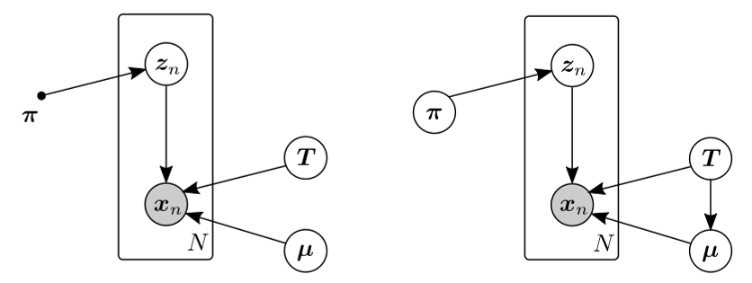
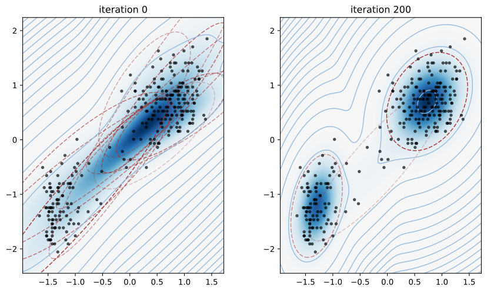

# Variational Bayesian Model Selection for Mixture Distributions

Two Variational Bayesian Gaussian mixture models proposed in [1] and [2] are compared. Their graphical models are respectively shown below.

- The implementation for the first model [1], is implemented through the class `VariationalGaussianMixture` in `src.viGMM_CB`.
- The full Bayesian GMM model [2] is implemented in the class `VariationalGaussianMixture` in `src.viGMM_full`.
## Installation
First clone the project
```
git clone https://github.com/JulienNonin/variational-gaussian-mixture.git
cd variational-gaussian-mixture
```
`variational-gaussian-mixture` runs on Python 3.7. and only requires `matplotlib ≥ 3.2.1` and `numpy ≥ 1.18.1`.

## Usage
Import the module
```
import src as mixture
```
Load the "Old Faithful" data set and standardize the data.
```
X = np.loadtxt('data/faithful.txt')
X = (X - X.mean(axis=0)) / X.std(axis=0)
```
Apply a Bayesian GMM (`mixture.VariationalGaussianMixture`**`CB`** or `mixture.VariationalGaussianMixture`)
```
model = mixture.VariationalGaussianMixtureCB(K=10, display=True, max_iter=201, plot_period=200, init_param="kmeans")
model.fit(X)
```
This should produce the following output


## References
[1] A. Corduneanu and C. Bishop, *Variational Bayesian Model Selection for Mixture Distributions*. in *Proc. AI
and Statistics Conf.*, Jan. 2001, pp. 27-34.

[2] C. Bishop, *Pattern Recognition and Machine Learning (Information Science and Statistics)*. New York:
Springer-Verlag, 2006.

----
## To do

- [x] Create this README
- [x] Finally make the model without prior on mixing coefficients (viGMM_CB) work
- [x] Create a parent class (BaseGaussianMixture)
- [ ] move fit_predict to the parent class
- [ ] Generate a set of synthetic data
- [ ] Fix random initialization of responsabilities
- [x] Compute the ELBO for GMM_CB
- [ ] Compute the ELBO for GMM_full
- [x] Better visualization of GM
- [ ] Stopping criterion using the ELBO
- [ ] Make prediction
- [ ] Add prior on mean for GMM_CB to allow non-standardization